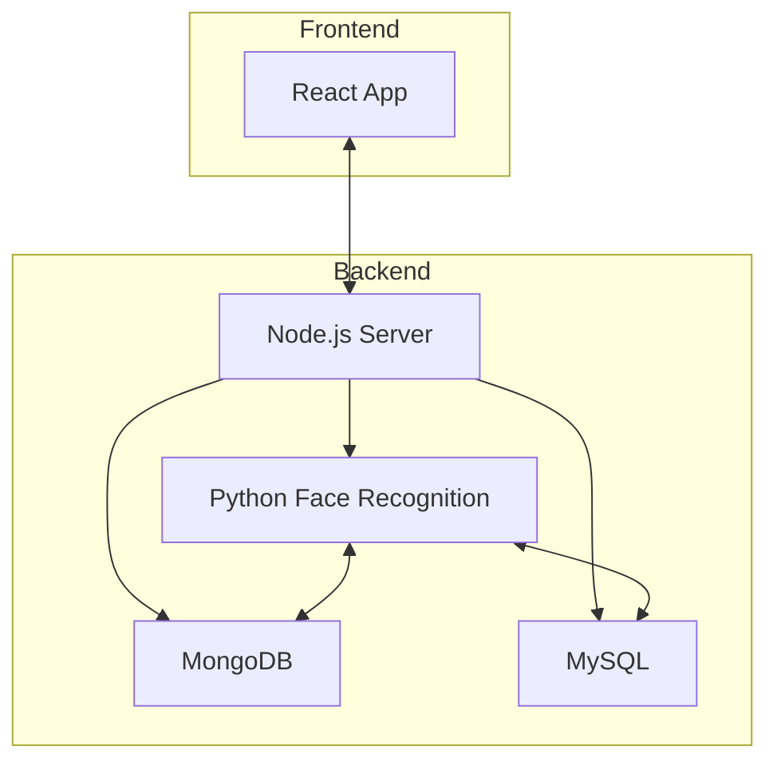

# SmartCampus-AI: Face Recognition Attendance System

## Overview
SmartCampus-AI is a comprehensive attendance management system that leverages face recognition technology for secure and automated attendance tracking. It features a modern React frontend and a robust Node.js/Python backend, supporting both MongoDB and MySQL databases.

---

## System Architecture



---

## Features
- Face scanning and recognition for attendance
- Real-time dashboard for teachers and students
- Secure authentication and role-based access
- Data storage in MongoDB and MySQL
- Easy deployment and scalability

---

## Folder Structure
```
attendance/
  backend/    # Node.js & Python backend
  frontend/   # React frontend
```

---

## Quick Start
1. **Clone the repository**
2. **Install dependencies**
   - Backend: `cd attendance/backend && npm install`
   - Frontend: `cd attendance/frontend && npm install`
3. **Configure environment variables**
   - Copy `.env.example` to `.env` and update values
4. **Start servers**
   - Backend: `npm start` or `python python_recognition.py`
   - Frontend: `npm run dev`


---


---

